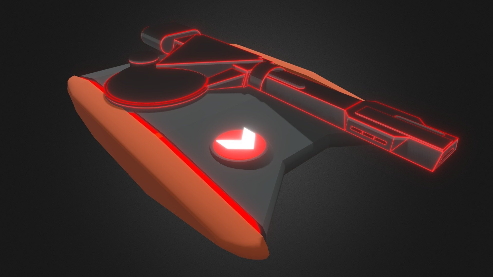
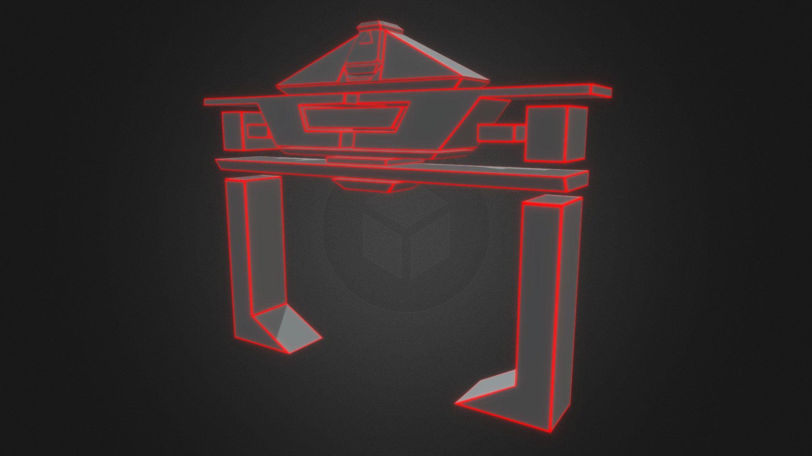
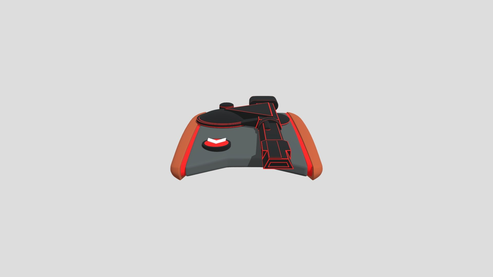
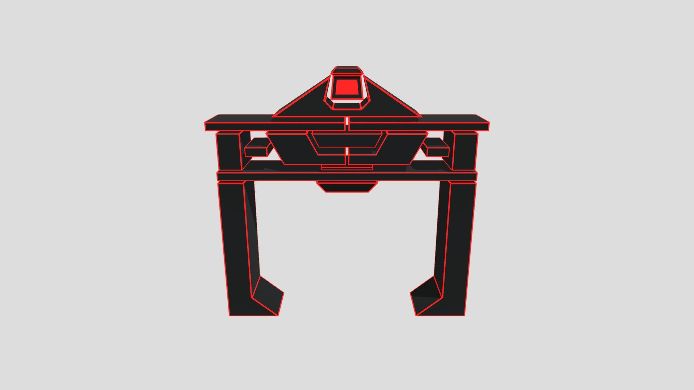

The tank and Recognizers are user-supplied Sketchfab GLBs; Sark’s carrier is a user-supplied JIHS Collada model converted locally to GLB. All are served locally with the application. Maze geometry is generated locally; vehicle/cannon audio uses short edits from the user-supplied film clip, with synthesized fallback and impact effects. No purchase was made. See [Models](../models/index.html) for source credits and adapter details.

| Asset | Source / author | Format and size | Use / attribution | Status |
| --- | --- | --- | --- | --- |
| Tank | arabinowitz / Sketchfab | GLB, 1.82 MB | Embedded Standard license; creator listing additionally says editorial purposes only | Imported and active |
| Recognizer | Shriker1 / Sketchfab | GLB, 128 KB | Embedded Sketchfab Standard license | Imported and active |
| Sark’s carrier | JIHS / TurboSquid; supplied by user | GLB, 6.86 MB, seven embedded textures | Listing Standard license; source readme retained | Background straight-line transit |
| Maze slabs and surrounding grid | Fixed branching topology, oblique convex prism geometry | JavaScript / generated buffers | Original project implementation | Active |
| Tank movement and Recognizer flight/approach | User-supplied TRON scene | Three stereo PCM WAV loops, about 0.76 MB combined | Film-derived excerpts; source/timecodes below | Active, awaiting auditory review |
| Cannon | User-supplied TRON scene | Stereo PCM WAV, 102 KB | Film-derived excerpt | Active |
| Impact, destruction, missing-file fallback | Project Web Audio synthesis | Short oscillator/noise envelopes | Original synthesized effects | Active |
| UI and favicon | Project HTML/CSS; inline favicon path | Local Interface Raster terminal font derived from VT323; system fonts elsewhere | Original project implementation | Active |
| Terminal font | Peter Hull / [VT323 in Google Fonts](https://github.com/google/fonts/tree/main/ofl/vt323) | Local `public/fonts/VT323-Regular.ttf` | SIL Open Font License 1.1; retained in `public/fonts/OFL-VT323.txt` | Active |
| Film reference stills | User-supplied screenshots from the linked 1982 sequence | 15 PNGs in `docs/references/images/` | Study references; not used as runtime art | Inspected |
| Three.js | [Three.js](https://github.com/mrdoob/three), installed 0.186.0 | npm dependency, lockfile pinned | MIT; upstream license remains in package | Active |
| colvmn | [Steve Dekorte / colvmn](https://github.com/stevedekorte/colvmn) | Local documentation engine checkout | MIT; upstream license retained | Active for docs only |

## Evaluated external candidates

| Candidate | Creator | Published details | Decision |
| --- | --- | --- | --- |
| [Tank — Tron (1982)](https://sketchfab.com/3d-models/tank-tron-1982-b730d118f54b4a868339a4ddf11e09a7) | arabinowitz | Listing describes Blender/FBX files, about 58k triangles, free download, and editorial use. The listing's generic “Free Standard” label should not be substituted for reviewing the actual terms. | User supplied the GLB; imported and browser-tested. |
| [TRON Immersive](https://www.behance.net/gallery/236722545/TRON-Immersive) | Steve Talkowski | Creator presents tank and Recognizer work with embedded viewers. | Reference/candidate only; no download permission or usable distributable asset established. |

No paid candidate was selected and no purchase was made. Both GLBs load with GLTFLoader and uniform normalization; the original files remain unmodified.

The TRON names and film designs identify the user's reference. This inventory does not claim ownership of the underlying film property or permission to redistribute film assets.

## Historical replacement model shortlist — September 12

The user judged the second procedural pass closer but still inaccurate and requested internet models. Inspected the four public preview images below and queried Sketchfab's official metadata API. All four are marked downloadable. At the time of this initial search, no source mesh had been acquired or imported: an unauthenticated request to the official tank download endpoint returned `Authentication credentials were not provided.` The user subsequently supplied the two active GLBs above. Preserve the source archive and included license when downloading.

**Recommended first: Shriker1's pair.** The tank preview has a much better broad hull, offset canopy, triangular cannon supports, collar and recessed muzzle. The Recognizer preview has the articulated-looking shoulder construction, substantial body depth and inward feet. Both are described by the creator as custom-made and game-ready. That description and the polygon counts make them promising for the browser; materials, movable parts and final fidelity still need inspection in the source files.

| Model | Creator | Triangles | Published terms / formats |
| --- | --- | --- | --- |
| [Tron 1982 Tank](https://sketchfab.com/3d-models/tron-1982-tank-99f4ae8ce97445e8909c02d7481d12d9) | Shriker1 | 9,648 | Free Standard per official metadata; source formats not verified |
| [Tron 1982 Recognizer](https://sketchfab.com/3d-models/tron-1982-recognizer-ecb52608275c40a28d7d9dda1aed54f3) | Shriker1 | 1,854 | Free Standard per official metadata; source formats not verified |
| [Tank — Tron (1982)](https://sketchfab.com/3d-models/tank-tron-1982-b730d118f54b4a868339a4ddf11e09a7) | arabinowitz | 57,976 | Blender/FBX; listing says editorial use only |
| [Recognizer — Tron (1982)](https://sketchfab.com/3d-models/recognizer-tron-1982-897ad9061ab34a9885b8e874fe8a17e0) | arabinowitz | 8,080 | Blender/FBX; listing says editorial use only |

Sketchfab labels all four Free Standard; the arabinowitz descriptions additionally restrict use to editorial purposes. The current license page could not be fetched, so these are recorded listing terms, not completed license clearance. Metadata snapshots and public promotional previews are retained in `candidates/` for comparison; they are not runtime assets.

### Shriker1 tank preview

### Shriker1 Recognizer preview

### arabinowitz alternatives

Also found [JIHS's TRON 1982 Tank on TurboSquid](https://www.turbosquid.com/3d-models/3d-tron-1982-tank-1811154), listed at $25, 49,152 polygons, with FBX/OBJ/glTF among the offered formats and an editorial-use restriction. It is a paid fallback; no purchase was made.

The simulation revision still uses the procedural vehicle models. Recognizers are uniformly scaled by 0.5 in the adapter; collision uses the same scale. Five instances and five independent spatial sound voices replace the single scripted craft. Maze roof/side geometry is generated from the same clipped convex polygons used by collision and visibility.

## Requested film audio pass

Source: https://www.youtube.com/watch?v=kKBuOtedf3E — “Tron (1982) - Clu infiltrates the Encom system,” uploaded by vson8, 199 seconds. Metadata was retrieved on September 13; both audio-only Opus and standard MP4 media downloads returned HTTP 403. No film audio was extracted or added. Existing synthesized effects remain active. Await a local copy before isolating tank movement, cannon shots and Recognizer motion.

## Local video sound extraction — September 13

The user supplied `docs/references/videos/1982 tron clu scene.mp4` (187.48 s, 44.1 kHz stereo AAC). This resolved the earlier YouTube download block. Selected cuts using exterior action frames and signal/spectrum inspection. Source audio is a mixed film soundtrack; these edits are not isolated production stems. No direct auditory assessment was available in this run, so speech/score contamination and subjective fidelity remain for user audition.

| Runtime sample | Local video in/out | Processing |
| --- | --- | --- |
| tank-drive.wav | Spectrum derived from 10.75–11.45 s | 5.94-second periodic engine bed reconstructed from the filtered film sample’s averaged spectrum. Randomized phases remove recurring source transients; original time-domain stereo is replaced by a compact emitter panned in-game. Rebuild with `scripts/smooth-tank-loop.py`. |
| recognizer-flight.wav | 124–126 s | 45 Hz high-pass, 6.5 kHz low-pass, 120 ms loop crossfade |
| recognizer-approach.wav | 126.20–128.40 s | Same filters/crossfade; mixed into pursuit and attack |
| cannon.wav | 121.38–121.76 s | 65 Hz high-pass, 12 kHz low-pass, 3 ms attack/70 ms release fades |

All retain two channels, receive DC removal and peak normalization to 0.72, and are stored in `public/audio/`. Rebuild with `python3 scripts/extract-sfx.py` (ffmpeg required). `public/audio/sources.json` records the input SHA-256, cuts and processing. Credits: TRON (1982) film soundtrack, supplied by the user for this local study; no redistribution license has been established. The full reference video is excluded from the static build.

[Sound audition](http://127.0.0.1:5173/audio.html) provides individual loops and a moving stereo Recognizer using the game's HRTF emitter. Each craft has two world-space emitters 4.8 m apart, independent loop offsets, distance attenuation, wall low-pass/attenuation and bounded Doppler playback-rate shifts. The listener follows Clu with camera orientation, rather than moving hundreds of meters away with the aerial camera.

Tank revision: the user identified dialogue in the original 70.80–73.20 s cut. Replaced it with a short opening texture from 10.75–11.45 s (0.58 s after crossfade), chosen using the opening frames and spectrum. Listening confirmation remains with the user. Recognizer and cannon WAV hashes are unchanged.

Cannon revision: shortened the film cut to 0.38 s around the first firing onset to reduce neighboring rapid-fire content, widened the passband, and removed random playback pitch. Inspected frames at 120.8–123.2 s and measured waveform onset at 121.38 s. This is still mixed film audio; listening approval is pending. Terminal clicks and access beep are synthesized approximations, not extracted movie sounds.

Camera-listener revision: all spatial listening now uses the camera, including its height and movement. The tank has an 18 m reference-distance stereo emitter, so zooming away attenuates its sound. This supersedes the earlier Clu-anchored listener description. The opening tracks Clu's live position while it starts at full speed; releasing W ends the initial throttle.

## Opening music

User-supplied `music/Tron/03 We've Got Company.mp3` plays once from the beginning when a run starts, including the opening zoom. It pauses with standby, resumes from its current position, follows the sound mute/master volume, and restarts on R. A single streaming media element feeds the audio mix at 55% gain. Vite packages this selected track; the documentation copy excludes the rest of the supplied album. Source: user's local TRON film soundtrack collection; no new redistribution license established.

Terminal keys now use four stereo excerpts from the first two seconds of the supplied local video, starting at 0.885, 1.395, 0.995 and 1.585 seconds. The latest revision trims each to 60 ms, lowers the low-pass cutoff to 6.5 kHz, and adds an early decay with a smooth 30 ms release to suppress the harsh trailing transient reported by the user. Samples alternate without immediate repeats; synthesized ticks remain a loading/failure fallback. The access beep remains synthesized. Audio context resume and music play are both requested directly during Return's input event, before any asynchronous yield.

## Carrier rumble

`scripts/extract-carrier-sfx.py` reproducibly extracts 116.2–120.2 seconds of the user-supplied carrier/solar-sailer video. `public/audio/carrier-rumble.wav` is stereo PCM, 44.1 kHz, 3.6 seconds after a 0.4-second loop crossfade, DC removal, 35–900 Hz filtering and peak normalization to 0.65. Provenance/hash and processing are in `public/audio/carrier-source.json`. This is a mixed film soundtrack excerpt, not an isolated vehicle stem. Auditory approval remains pending; the assistant has not listened to the sample. In-game it uses stereo HRTF placement, camera distance attenuation, distant low-pass filtering and Doppler following the carrier's world position. The master mute/standby gate applies.

September 14: eight ground enemies reuse arabinowitz's supplied tank GLB, normalized geometry, surface materials and cannon sample. Each clone has independent turret/recoil transforms and red insignia. Source assets are unchanged; no additional models were downloaded.

### September 14 Recognizer sound revisions

Re-cut `recognizer-flight.wav` from exactly 2:04–2:06 of the local `1982 tron clu scene.mp4`; stereo PCM with the existing 120 ms loop join (1.88-second playback). Added `recognizer-explosion.wav` from 3:06–3:07, a one-second stereo effect with short edge fades, 45 Hz high-pass and 12 kHz low-pass. Recognizer destruction plays it through two world-space HRTF emitters; tank destruction retains its existing sound. Both excerpts are available on `/audio.html`. These remain mixed film soundtrack excerpts, not isolated sound-effect stems.

Correction: the 3:06–3:07 selection contained terminal typing. `recognizer-explosion.wav` now uses video time 1:47.84–1:48.69 (0.85 seconds), aligned with the visible explosion before the cockpit cut. Recognizer excerpts are now extracted from the user-supplied M4A. Full decoded PCM comparison found that M4A equals the video audio after trimming its first 2112 frames (47.89 ms); the extraction script compensates for this offset and records source/seek per sample. The game and audition page request version 2 of the explosion to bypass the previous cached audio.

The supplied `Recognizer Explosion.m4a` edit matches video time 113.207 seconds (normalized waveform correlation 0.997). `scripts/clean-recognizer-explosion.py` uses surrounding soundtrack context and shared-stereo harmonic/percussive masks to suppress sustained tonal ridges. It generates original/balanced/strong audition WAVs under `public/audio/studies` and a provenance manifest. Requires NumPy/SciPy (installed only in a temporary environment). This is approximate suppression: overlapping cannon/explosion energy cannot be reliably separated by this method, and stronger masking loses transient detail. Listening comparison is pending.

## Sound resource library

[Open the sound library](../sounds/index.html) for downloaded Syna-Max recreation previews, existing film edits, cleanup candidates, verified stock-effect catalog IDs and vendor metadata exports. The shelf preserves inactive resources, author/source links and licensing notes for this personal-use project. `docs/sounds/catalog.json` is the editable inventory; `scripts/build-sound-library.mjs` regenerates its page during the docs build. Public MP3 previews are clearly distinguished from original downloads and unacquired commercial-library audio.

### MCP closing dialog

`docs/references/dialog/END OF LINE.mp3` is the user-supplied MCP “END OF LINE” film dialog (1.28-second MP3). It plays once as the terminal starts typing the final sign-off. Imported directly through Vite and decoded into Web Audio; no edits to the source recording. Source: Disney's 1982 TRON, supplied by the user for this fan tribute.

### Embedded terminal raster font

`public/fonts/InterfaceRaster-Regular.ttf` is a modified VT323 font, renamed **Interface Raster**. Each of 582 glyphs retains its original monochrome outline and adds COLRv0 layers: bright pixels plus 15-unit bands at 68% brightness within each 80-unit source pixel row. The two embedded palettes match terminal blue and sign-off red. This replaces the screen-space scanline mask, keeping the dim bands aligned through typing, resizing, and sentence fades. The CSS cursor receives a matching dim-band treatment.

Based on Peter Hull's VT323 under SIL OFL 1.1; original notices remain in the font and `public/fonts/OFL-VT323.txt`. Rebuild with `uv run --with fonttools==4.65.0 --with skia-pathops==0.9.2 python scripts/build-terminal-font.py`. No extra dependencies are needed to run the game.

## Debris physics

Rapier 3D (`@dimforge/rapier3d-compat` 0.20.0), by Dimforge, Apache-2.0. The local npm package includes WebAssembly; no runtime CDN is required. Used for vehicle debris only. [Source and license](https://github.com/dimforge/rapier).
